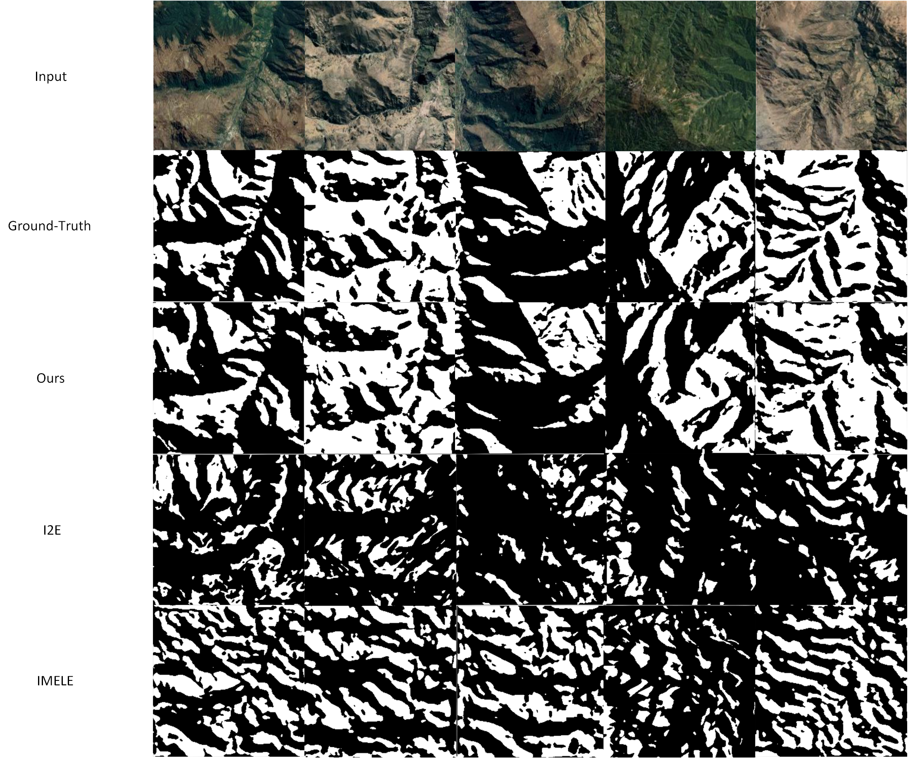
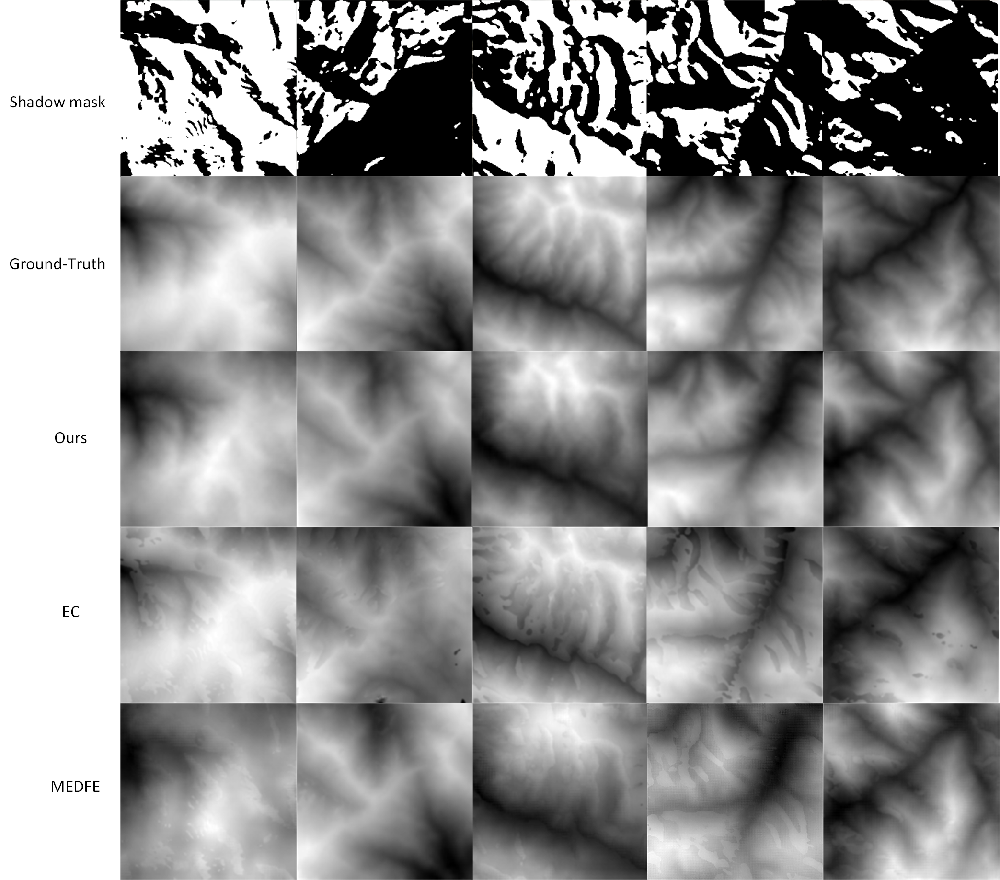

# Terrain-Gap-Filling-from-Single-View-Satellite-Imagery
Supplementary Materials for the Paper “Terrain Gap Filling from Single-View Satellite Imagery based on Prior Geographical Knowledge Constraints”

## Related Work

To address the problem of missing data in digital elevation models (DEMs), conventional approaches include manual reconstruction, integration with other data sources, as well as various interpolation techniques. However, these methods face significant limitations. Manual reconstruction is often costly in terms of time and labor, the integration of DEMs from different sources frequently results in quality inconsistencies, and interpolation in complex terrain regions often fails to achieve satisfactory results [1, 2, 3]. Therefore, deep learning techniques, owing to their powerful data learning and pattern recognition capabilities, have gradually become the mainstream approach for addressing missing data in DEMs. Unlike traditional methods, deep learning approaches are able not only to learn local terrain features but also to capture global information and contextual characteristics. This enables the model to extract latent information from consistent terrain patterns, thereby facilitating the effective reconstruction of complete DEMs [4, 5].

Numerous inpainting models based on generative adversarial networks (GANs) have demonstrated outstanding performance in practical applications. For example, Nazeri et al. proposed EdgeConnect [6], which performed inpainting guided by image edges in the missing regions and achieved remarkable results in pixel-level tasks. However, inpainting methods based on pixel-level loss functions neglect the semantic constraints inherent in terrain, thereby violating the principle of terrain continuity. As a result, the completed terrain often exhibits artifacts such as distorted shadow distributions and disrupted runoff patterns, which are inconsistent with real-world physical rules [7, 8].

To address these issues, many studies have leveraged the CGAN framework in combination with specific terrain information to improve refinement effectiveness. For example, Dong employed automatically extracted projected shadow maps together with known solar directions as shadow-based supervisory signals, in conjunction with conventional supervision derived directly from DEMs, thereby successfully enhancing the quality of the refinement results [7]. Qiu et al. [9], on the other hand, jointly trained on global mountainous SRTM data along with elevation-related terrain features such as relief, effectively capturing more fine-grained topographic information and thereby enhancing the model’s capability to complete missing regions.

Although these methods have made certain progress in integrating terrain information, several challenges remain, particularly regarding how to optimize the selection and integration of such information to further enhance the quality of the reconstructed DEM. For example, identifying which specific types of terrain information can effectively improve refinement performance and how to accurately incorporate them into deep learning models remain open issues. To address these challenges, Li et al. [10] proposed a constrained terrain knowledge-based CGAN model (TKCGAN), which effectively incorporates terrain feature knowledge into the training process, thereby enhancing the model’s ability to recover critical terrain characteristics. Zhou et al. [11] proposed a multi-scale feature fusion CGAN approach, which, after preliminary inpainting, employs a multi-attention refinement network to further recover details in the missing regions and introduces a channel-spatial pruning mechanism to enhance network performance.

In summary, inpainting plays a crucial role in addressing missing data in DEMs, and deep learning methods have achieved remarkable results in terrain inpainting tasks. However, key challenges remain in further optimizing the integration and feature learning of terrain information, as well as in enhancing the model's generalization ability and refinement performance. First, existing approaches often underutilize critical terrain features, such as slope, aspect, and curvature, limiting the recovery of fine-scale details. Second, integrating multi-source terrain information (e.g., elevation, texture, satellite image) remains challenging, leading to potential information loss or redundancy. Third, current models exhibit limited generalization to unseen or complex terrains, reducing the reliability of predictions. Addressing these issues requires more effective strategies for terrain feature selection, multi-source integration, and enhancement of model generalization and refinement capabilities.

## Method
### Network Architecture Details

Our model follows the **pix2pix** architecture[12], which uses a Conditional Generative Adversarial Network (cGAN) to learn a mapping from input images to output images.

#### 1. Generator ($G$): U-Net-256

The generator's goal is to translate the input image into a realistic output image. We utilize a **U-Net** architecture with skip connections to preserve low-level structural information.

##### Architecture Design
Unlike a standard Encoder-Decoder which bottlenecks information, the U-Net adds **skip connections** between layer $i$ and layer $n-i$.
*   **Input Resolution:** $256 \times 256 \times 3$
*   **Skip Connections:** Concatenate channels from the encoder layer $i$ with the decoder layer $n-i$.
*   **Dropout:** Applied to the first few layers of the decoder (even at test time) to introduce stochasticity.

##### Layer Specification
Let `Ck` denote a block of **Convolution-BatchNorm-ReLU** with `k` filters.
Let `CDk` denote a block of **Convolution-BatchNorm-Dropout-ReLU** with `k` filters.

**Encoder Stack:**
1.  **C64** (4x4 conv, stride 2, LeakyReLU 0.2) *[No BatchNorm in the first layer]*
2.  **C128** (4x4 conv, stride 2, LeakyReLU 0.2)
3.  **C256** (4x4 conv, stride 2, LeakyReLU 0.2)
4.  **C512** (4x4 conv, stride 2, LeakyReLU 0.2)
5.  **C512** (4x4 conv, stride 2, LeakyReLU 0.2)
6.  **C512** (4x4 conv, stride 2, LeakyReLU 0.2)
7.  **C512** (4x4 conv, stride 2, LeakyReLU 0.2)
8.  **C512** (4x4 conv, stride 2, LeakyReLU 0.2) *[Bottleneck]*

**Decoder Stack (with Skip Connections):**
1.  **CD512** (4x4 transposed conv, stride 2, ReLU) + Concat with Encoder layer 7
2.  **CD512** (4x4 transposed conv, stride 2, ReLU) + Concat with Encoder layer 6
3.  **CD512** (4x4 transposed conv, stride 2, ReLU) + Concat with Encoder layer 5
4.  **C512** (4x4 transposed conv, stride 2, ReLU) + Concat with Encoder layer 4
5.  **C256** (4x4 transposed conv, stride 2, ReLU) + Concat with Encoder layer 3
6.  **C128** (4x4 transposed conv, stride 2, ReLU) + Concat with Encoder layer 2
7.  **C64** (4x4 transposed conv, stride 2, ReLU) + Concat with Encoder layer 1
8.  **Output Layer**: 4x4 transposed conv, stride 2, **Tanh** Activation $\to$ Output Image ($256 \times 256 \times 3$)

---

#### 2. Discriminator ($D$): 70x70 PatchGAN

The discriminator is a Markovian discriminator (PatchGAN) that classifies $N \times N$ patches of the image as real or fake, rather than classifying the entire image at once.

##### Design Principles
*   **Why PatchGAN?** L1 loss is sufficient for capturing low frequencies (colors, general structure) but fails at high frequencies (sharp edges, textures). The PatchGAN restricts attention to local image patches to model high-frequency structures.
*   **Receptive Field:** This implementation uses a **70x70** receptive field. This means each output neuron in the discriminator's final $30 \times 30$ grid sees a $70 \times 70$ pixel region of the input image.
*   **Output:** The final D score is the average of all patch predictions.

##### Layer Specification
Let `Ck` denote **Convolution-BatchNorm-LeakyReLU**.

1.  **Input:** Concatenation of Source Image ($x$) and Target/Generated Image ($y$) $\to$ 6 channels.
2.  **C64** (4x4 conv, stride 2, LeakyReLU 0.2) *[No BatchNorm]*
3.  **C128** (4x4 conv, stride 2, LeakyReLU 0.2)
4.  **C256** (4x4 conv, stride 2, LeakyReLU 0.2)
5.  **C512** (4x4 conv, stride 1, LeakyReLU 0.2)
6.  **Output Layer**: 4x4 conv, stride 1, **Sigmoid** Activation.
    *   *Output Shape:* $30 \times 30 \times 1$ map of validity scores.

---

### Differentiable renderer based on mountain shadow priors

The shadow-constrained terrain gap-filling framework renders the DEM using a differentiable renderer to obtain a shadow mask corresponding to the generated terrain, which is then employed to constrain model training. This section presents the process of generating shadow masks with a differentiable renderer.

In the shadow mask generation task, to ensure that the generated shadow masks are consistent with the real shadow masks in terms of illumination, it is first necessary to determine the illumination direction corresponding to each satellite image. Then, the generated terrain is illuminated under the same lighting conditions to maintain consistent lighting effects. This study adopts the illumination direction inversion algorithm proposed by Zhou et al.[8] to estimate the zenith and azimuth angles of the light source.

The algorithm first preprocesses the satellite image to extract an approximate shadow distribution, as described in **Algorithm 1**. In each iteration, a differentiable rendering algorithm is used to render the digital elevation model, from which shadow distribution information is obtained. Then, the zenith and azimuth angles are treated as optimization targets, and the L1 distance error between the target shadow distribution and the rendering result is minimized using the Adam optimization algorithm. Finally, when the error falls below a set threshold, the accurate lighting conditions are obtained, completing the illumination inversion process.

### Algorithm 1: Inverse Lighting Estimation

**Input:**  
- Satellite image `M`  
- Digital elevation model `T`  
- Threshold `ε`  

**Output:**  
- Zenith angle `θ`  
- Azimuth angle `φ`  

1. Extract approximate shadow distribution:  
   `S_gt ← ExtractShadow(M)`  

2. Initialize lighting parameters `(θ, φ)`  

3. **While** `L > ε` **do**  
   3.1 Render shadow:  
   `S_pred ← DiffRender(T, θ, φ)`  

   3.2 Optimize:  
   `(θ, φ) ← AdamOpt(L, θ, φ)`  

4. **Return** `(θ, φ)`  

For the reconstructed terrain, the method simulates sunlight with white light and applies white as the terrain texture. The zenith and azimuth angles obtained from illumination inversion are used as the lighting direction for rendering. Subsequently, the method uses a differentiable image processing algorithm to convert the rendered result from the RGB color space to the YUV color space to better capture the luminance and chrominance information of the rendered image. Then, a differentiable contrast-limited adaptive histogram equalization algorithm is applied to the YUV image to enhance local contrast. Finally, the processed image is converted back to the RGB color space to obtain the final shadow mask.
## Experimental Results and Analysis

The training and testing of the terrain prediction module and the terrain refinement module are conducted in the Python 3.8.19 and PyTorch 1.13.0 environment, deployed on a desktop computer equipped with an NVIDIA GeForce RTX 3090 Ti 24GB GPU and an Intel Core i5-13600K 3.50 GHz CPU. The satellite image in the dataset is obtained from Google Maps at a zoom level of 12, and the corresponding DEMs are derived from [Tangrams Heightmapper](https://tangrams.github.io/heightmapper/), maintaining the same zoom level. Both the satellite images and the DEMs are processed at a resolution of 256 × 256. The training set consists of 4,096 paired samples of satellite imagery, DEMs, and shadow masks, while the testing set contains 1,024 samples.

### Training Details

#### Terrain Prediction Module
- **Optimizer:** Adam  
- **Initial learning rate:** 0.0003 (linear scheduling)  
- **Momentum parameters:**  
  - β₁ = 0.5  
  - β₂ = 0.999  
- **Loss weighting coefficients:**  
  - λg₁ = 1.1  
  - λm = 2.0  
  - λt = 0.5  
  - λs = 10⁻⁴  
- **Batch size:** 4  
- **Epochs:** 300  

#### Terrain Refinement Module
- **Optimizer:** Adam  
- **Initial learning rate:** 0.0002  
- **Momentum parameters:**  
  - β₁ = 0.9  
  - β₂ = 0.999  
- **Loss weighting coefficients:**  
  - λg₂ = 1.0  
  - λm = 2.0  
  - λi = 1.5  
  - λs = 10⁻⁴  
  - λk = 0.8  
- **Batch size:** 4  
- **Epochs:** 400

**Figure 1.** Comparison of terrain refinement shadow masks. The first row shows the input satellite imagery and the second row presents the ground-truth masks. Rows 3–5 display the results of our method, I2E, and IMELE, respectively. Our approach yields shadow distributions closest to the ground truth, effectively capturing terrain semantics, while I2E exhibits noticeable errors and IMELE produces fragmented shadows.

**Figure 1.** shows the comparison results of shadow masks generated by different methods. In this experiment, differentiable rendering is employed to simulate illumination, producing terrain shadow masks consistent with the lighting conditions of the satellite image. It can be observed that the shadow distribution generated by our method is closest to the ground truth, demonstrating superior capability in learning both shadow constraints and terrain semantics. In contrast, the shadow mask produced by the I2E method exhibits significant errors, exposing the limitations of relying solely on pixel-space analysis. This indicates that the model fails to correctly distinguish between the optical properties of surface materials and the geometric characteristics of actual terrain undulations, resulting in mismatches between shadow distribution and terrain generation logic. The IMELE method, on the other hand, generates fragmented shadows, highlighting the limitations of conventional convolutional architectures. Although convolution–deconvolution networks are able to capture local texture features, their restricted receptive fields hinder the ability to model the systematic relationships between shadow distributions and geomorphological structures in real terrain.

**Figure 2.** Comparison of terrain gap filling results. The first row shows the shadow masks, followed by the ground-truth DEMs. Subsequent rows display the reconstructed terrain using our method, EC, and MEDFE, respectively. Our approach better preserves terrain continuity within shadowed regions and avoids the irregular artifacts and elevation distortions observed in EC and MEDFE.

As illustrated in **Figure 2**, our method demonstrates a clear advantage over the baseline models in filling missing regions within shadowed areas of complex terrain. The EC model generates irregular artifacts along the boundaries of shadow masks, which stem from structural limitations inherent in its two-stage generation mechanism. Specifically, the edge generation stage relies on ridgelines and valley lines as prior guidance; however, the spatial misalignment between shadow regions and terrain feature lines introduces deviations in edge prediction. Furthermore, the subsequent refinement stage employs a pixel-wise reconstruction loss without explicit enforcement of terrain continuity, leading to non-physical oscillations in local elevation values. The MEDFE model, although stable in large continuous shadow regions, produces significant distortions in complex mask areas where illuminated and shadowed regions are interwoven. On one hand, the channel-attention mechanism of its feature equalization module excessively amplifies high-frequency texture features, which conflicts with the low-frequency continuity characteristics of terrain data, resulting in grid-like artifacts within the restored regions. On the other hand, the spatial equalization strategy, which depends on local neighborhood statistics, fails to capture large-scale terrain gradient constraints, thereby causing discontinuous elevation jumps in the reconstructed results.

### References
[1] F. Hallo, G. Falorni, and R. L. Bras, *Characterization and quantification of data voids in the shuttle radar topography mission data*, IEEE Geosci. Remote Sens. Lett., vol. 2, no. 2, pp. 177–181, 2005.  
[2] S. J. Boulton and M. Stokes, *Which DEM is best for analyzing fluvial landscape development in mountainous terrains?*, Geomorphology, vol. 310, pp. 168–187, 2018.  
[3] H. I. Reuter, A. Nelson, and A. Jarvis, *An evaluation of void-filling interpolation methods for SRTM data*, Int. J. Geogr. Inf. Sci., vol. 21, no. 9, pp. 983–1008, 2007.  
[4] G. Dong, F. Chen, and P. Ren, *Filling SRTM void data via conditional adversarial networks*, in Proc. IEEE Int. Geosci. Remote Sens. Symp. (IGARSS), 2018, pp. 7441–7443.  
[5] W. Li and C. Hsu, *Automated terrain feature identification from remote sensing imagery: A deep learning approach*, Int. J. Geogr. Inf. Sci., vol. 34, no. 4, 2020.  
[6] K. Nazeri, E. Ng, T. Joseph, et al., *EdgeConnect: Structure guided image inpainting using edge prediction*, in Proc. IEEE Int. Conf. Comput. Vis. Workshops (ICCVW), 2019, pp. 3265–3274.  
[7] G. Dong, W. Huang, W. A. P. Smith, and P. Ren, *A shadow-constrained conditional generative adversarial net for SRTM data restoration*, Remote Sens. Environ., vol. 237, pp. 111602, 2020.  
[8] P. Zhou, D. Lu, C. Li, et al., *Unsupervised textured terrain generation via differentiable rendering*, in Proc. ACM Int. Conf. Multimedia (ACM MM), 2022, pp. 2654–2662.  
[9] Z. Qiu, L. Yue, and X. Liu, *Void-filling of digital elevation models with a terrain texture learning model based on generative adversarial networks*, Remote Sens., vol. 11, no. 23, pp. 2829, 2019.  
[10] S. Li, G. Hu, X. Cheng, et al., *Integrating topographic knowledge into deep learning for the void-filling of digital elevation models*, Remote Sens. Environ., vol. 269, pp. 112818, 2022.  
[11] G. Zhou, B. Song, P. Liang, et al., *Voids filling of DEM with multi-attention generative adversarial network model*, Remote Sens., vol. 14, no. 5, pp. 1206, 2022.  
[12] Isola, P., Zhu, J. Y., Zhou, T., & Efros, A. A. (2017). Image-to-image translation with conditional adversarial networks. CVPR.
